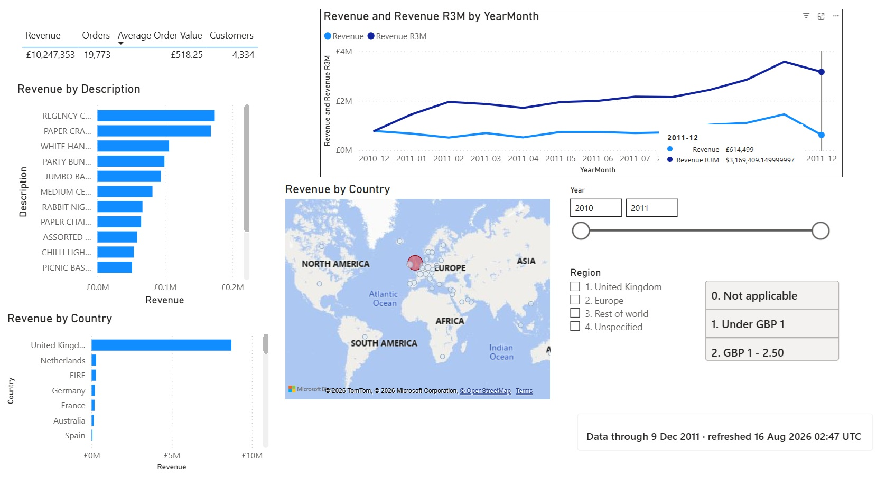

# Retail Data Pipeline & Product Recommendations

[](https://github.com/Kenchch/retail-ai-pipeline/actions/workflows/ci.yml)

A nightly pipeline that ingests retail invoice lines, enforces data quality,
publishes a sales star schema and a "frequently bought together" recommendation
table — plus the business-side work that decides whether any of it gets used: a
requirements brief, a user guide, an AI-literacy workshop and adoption
measurement wired into the pipeline itself.

```bash
pip install -r requirements.txt
python scripts/get_data.py           # ~45 MB of transactions + usage telemetry
python -m retail_pipeline.pipeline   # ~12 s end to end
pytest -q
```

## Results from a full run

Source: UCI **Online Retail** — a UK online giftware retailer, Dec 2010 – Dec 2011.

| | |
|---|---|
| Rows read | 541,909 line items across 25,900 invoices |
| Quarantined by data-quality rules | **19,343 (3.57%)** |
| Loaded | 522,566 line items · 3,803 products · 4,334 customers · 374 days (305 traded) |
| Recommendations | 17,083 rows covering the full catalogue |
| Adoption | 62 licensed users, 5 teams, 12 weeks |
| Runtime | 8.0 s of compute — `compute_seconds` in `reports/run_metrics.json`; the publish adds ~4 s on top |

The strongest associations are ones a merchandiser would expect — the cheapest
sanity check there is:

```
LANDMARK FRAME COVENT GARDEN  ->  LANDMARK FRAME OXFORD STREET   lift 196.4   30 baskets
CHILDS GARDEN SPADE BLUE      ->  CHILDS GARDEN SPADE PINK       lift  95.1   40 baskets
```

Outputs: [`reports/data_quality_report.md`](reports/data_quality_report.md) ·
[`reports/adoption_report.md`](reports/adoption_report.md) · `reports/run_metrics.json`

## Power BI semantic layer

The warehouse this pipeline publishes is consumed by a Power BI semantic model
in [`bi/`](bi/) — star schema with surrogate keys and an unknown member, a
calendar built for time intelligence, a second fact table for data quality
joined on conformed dimensions, a many-to-many bridge for the quality rules, a
35-measure DAX library and dynamic row-level security over an entitlement table.



Three report pages and the model view: [`bi/README.md`](bi/README.md).

Reconciles to £10,247,353.28 over 19,773 orders, and 522,566 loaded + 19,343
rejected = 541,909 — the source row count.

Design and the decisions behind it: [`bi/MODEL.md`](bi/MODEL.md).
Build it yourself in ~45 minutes: [`bi/BUILD_POWERBI.md`](bi/BUILD_POWERBI.md).

## How it works

```
extract → data quality → star schema → recommend ─┐
                                                  ├→ run metrics → publish → finalize
                          adoption (telemetry) ───┘
```

`recommend` and `adoption` are separate branches — adoption reads the usage
telemetry and needs nothing the extract produces. They meet at `run metrics`,
which builds the report version from the staged tables; `publish` is the only
task that writes to the warehouse, and `finalize` points `reports/CURRENT` at
the version or archives it.

Three modules, scheduled as ten Airflow tasks
([`dags/`](dags/retail_pipeline_dag.py)) so a failure names the stage that broke.
Every stage computes into per-run staging; a single `publish` task is the only
thing that writes to the warehouse.

The DAG's wiring is tested — `tests/test_dag.py` asserts the trigger rules and
the edges, because every bug it has carried has been a wiring bug rather than a
logic one, and none of those show up in a unit test of a stage function.
Airflow is not in `requirements.txt` (nothing but `dags/` imports it), so those
tests skip locally and CI installs it in a job of its own.

**Scope: a single-machine Airflow, `LocalExecutor` or `SequentialExecutor`.**
Staging, the warehouse and the reports are all local `pathlib` paths written
with `os.replace()` and `sqlite3.connect()`. That is a deliberate choice for a
portfolio project, and it is a real constraint rather than a detail: under
CeleryExecutor or KubernetesExecutor each task can land on a different worker,
where the Parquet an upstream task wrote is simply not there, and neither a
blob URI nor a network path is something `Path.mkdir()` or SQLite will accept.
Running this distributed means moving staging and the report versions onto
object storage (fsspec) and the warehouse onto a shared database — the stage
functions would not change, but every path in `config.yaml` would. Adding that
here would be cloud infrastructure in service of a demo.

**The guarantee, stated precisely.** A run is a *version*. Every Parquet
file and the SQLite database are written into `data/runs/<run_id>/`, nothing
in there is visible to anyone, and publishing it is a single `os.replace` of
`data/CURRENT` — one atomic filesystem operation. Consumers resolve the pointer
and read the version it names, so they see the previous run in full or this one
in full, never a mixture. A run that fails has its whole version directory
deleted; there is nothing to roll back because nothing was ever visible.

SQLite is still swapped in one transaction inside that version — tables built
as `<name>__new`, then dropped, renamed and indexed inside a single
`BEGIN IMMEDIATE` — and it carries the run_id in a `_publication` table, which
the publish checks against the directory before moving the pointer.

This replaced a SQLite commit followed by one `os.replace` per Parquet file. N
renames can half-succeed, and injecting an `OSError` into the second one
produced exactly what that implies: SQLite on tonight's run, `fact_sales` on
tonight's, `dim_product` and `quarantine` still on last night's — and since the
report finaliser took the SQLite stamp as its authority, `reports/CURRENT`
advanced as well. Anything reading the directory got tonight's facts joined
against last night's dimensions, in a run that reported success. Retirement is
structural now too: a table that stops being published is simply not written
into the new version, so the two layers cannot retire out of step.

**Reports are versioned, and published by a pointer.** Every run writes its
three reports into `reports/runs/<run_id>/`, all three built from the same
staged tables, and `reports/CURRENT` — a one-line file replaced with a single
`os.replace` — names the version a reader should read. Promoting three files
one at a time was not good enough: three `os.replace` calls can half-succeed,
and on Windows they routinely do, because replacing a file another process
holds open raises `PermissionError`. That left one new report beside two old
ones with nothing recording it. A version is complete before anything points at
it, so `reports/CURRENT` names last night's version or tonight's, never a
mixture. A run that fails is archived to `reports/failed_runs/<run_id>/` and
never becomes current. (The three files at the top of `reports/` are a copy of
the current version, committed so a reader does not have to clone and run the
pipeline; each one names its `run_id`.)

**What is *not* covered, stated exactly.** The data and the reports are two
versioned trees with two pointers — `data/CURRENT` and `reports/CURRENT` — and
no transaction spans them. `finalize_reports` moves the report pointer only
when `data/CURRENT` already names the same run, so the reports cannot get
ahead; but a crash between the two leaves the data published and the reports
one run behind. Collapsing them into a single pointer over a single tree is the
remaining step, and it would mean the reports and the warehouse sharing a
retention policy, which they should not — three markdown files are worth
keeping for months, half a gigabyte of Parquet is not.

The mismatch is made **detectable** rather than impossible. Every run logs
both:

```
Done in 12.2s | warehouse run local_20260819T094207619994 | reports run local_20260819T094207619994
```

Two different ids is a warehouse ahead of its reports, and re-running the
finaliser publishes the version the data pointer already names.

**Data quality (9 rules, 4 dimensions).** Cancellations, non-positive quantities
and prices, duplicates, price outliers and non-product stock codes are
**quarantined** — kept in a table with the rules they broke, not deleted, so a
rule that turns out to be too aggressive can be relaxed. Missing customer ids
(24.9% of rows — guest checkout) and blank descriptions are **flagged but kept**:
rejecting them would discard a quarter of the basket evidence to satisfy a rule
only customer analytics cares about. Above a configured rejection rate the run
**fails before loading**, so a broken extract leaves last night's data intact.

**Star schema.** `fact_sales` carries measures and keys only. `dim_date` is a
continuous calendar — this retailer is shut on Saturdays, and a dimension built
from observed dates would omit 53 of them and hand BI six-day weeks.

**Recommendations, two signals.** Co-purchase rules from transactions
(structured) ranked by **lift**, not raw co-occurrence — ranking by count makes
the best sellers the recommendation for everything. TF-IDF over product
description text (unstructured) covers the long tail that never reaches the
support threshold. Every row carries a `method` column so the two are never
conflated.

The population for support and confidence is **every** basket, including ones
holding a single item. A basket where A was bought alone is evidence against
"A → B", so dropping it inflates the rule. Three baskets, worked by hand:

```
{A}   {A, B}   {A, B, C}          all baskets = 3;  A in 3, B in 2, C in 1

support(A,B)    = 2/3 = 0.67
confidence(A→B) = 2/3 = 0.67      not 2/2 — the {A} basket stays in
lift(A,B)       = 0.67 / (2/3) = 1.0
```

`max_basket_size` filters pair *generation* only, for the same reason: a
1,107-item wholesale order would contribute 612k pairs of things that shared a
pallet, but the products in it were still sold. Both figures are therefore
conservative rather than inflated. `test_single_item_baskets_count_in_the_denominator`
pins the arithmetic above.

**Adoption.** Reach, activation, action rate and CSAT, weekly and by team.
Activation is the one that matters — a view changes nothing. A metric with no
data reports "–", never 0: nobody answering the survey is not everybody being
unhappy.

## The business-side half

| | |
|---|---|
| [Brief](docs/01_engineering_brief.md) | The problem, explicit non-goals, 7 requirements with acceptance criteria |
| [User guide](docs/02_user_guide.md) | How to read lift · three things the tool gets wrong · FAQ |
| [Adoption & comms](docs/03_adoption_and_comms.md) | Metric definitions, workshop runsheet, monthly update, roadmap |
| [Workshop deck](workshop/ai_literacy_workshop.pdf) | 6 slides, 60 minutes ([`.pptx`](workshop/ai_literacy_workshop.pptx)) |

Each one leads with what the tool **cannot** do — the brief lists non-goals, the
guide has "three things it will get wrong", the workshop opens on a real bad
recommendation. That is not modesty; it is the only way the rest gets believed.

> **On the usage data.** The event log is generated by `scripts/get_data.py`,
> because this has not been deployed to real users. The schema is the production
> schema and the metrics are computed from it for real; the production sources
> (Power BI usage metrics, merchandising audit log, feedback button) are
> documented in that script. Swapping in a real extract is one line in
> `config.yaml`. An adoption number of unclear provenance is worse than none.

## Tests

The suite is concentrated on the failures that are *silent*: a quality rule that
stops firing, a team that drops out of the adoption report, a week with no
activity that closes the gap and shifts every later week's label, a metric with
no data reported as a zero. Nothing crashes when those regress — bad rows just
start flowing into the warehouse, which is why the tests exist.

## Stack

Python · pandas · scikit-learn · Parquet · SQLite · Airflow (single machine,
see above) · Git. SQLite stands in for a served warehouse such as Azure SQL:
the star schema and the DAX over it would carry across unchanged, but the load
path itself would not — `BEGIN IMMEDIATE`, `ALTER TABLE ... RENAME` and the
local-filesystem Parquet swap are SQLite-and-one-host specific, so it is a
rewrite of `load()`, not a connection string. All thresholds and the team
roster live in `config.yaml`; there are no magic numbers in the code.

---

Data: UCI Machine Learning Repository — *Online Retail* (Chen, D., 2015).
