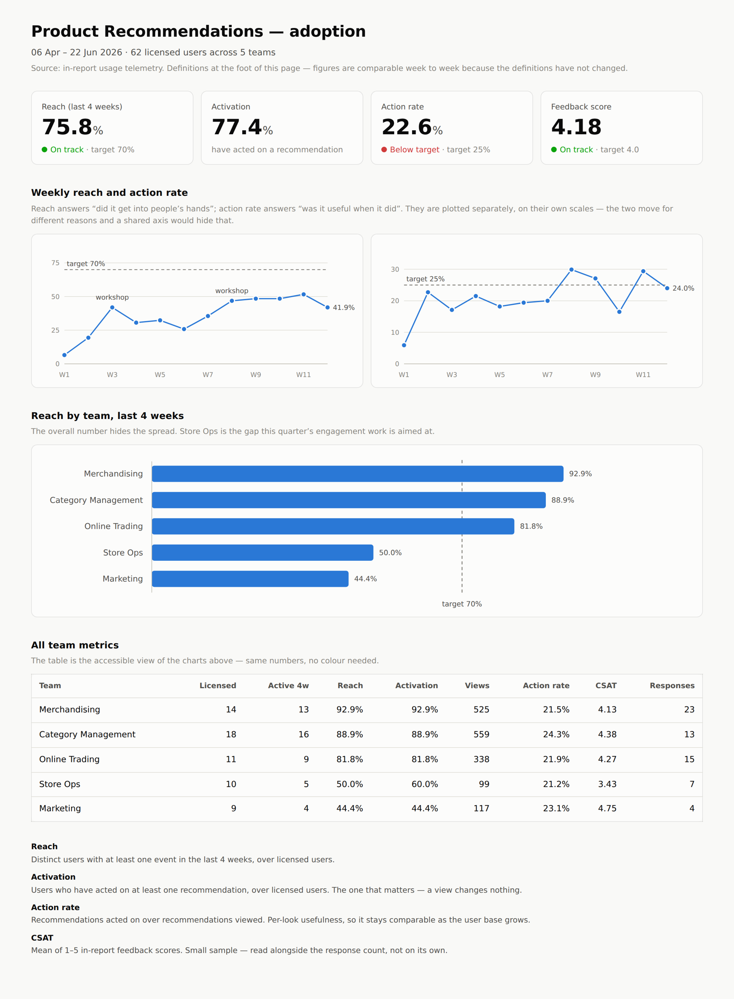

# Retail Data Pipeline & Product Recommendations

[](https://github.com/Kenchch/retail-ai-pipeline/actions/workflows/ci.yml)
[](LICENSE)

An end-to-end retail data product: a pipeline that ingests raw invoice lines,
enforces data quality, publishes a sales star schema and a "frequently bought
together" recommendation table — **and the business-side work that decides
whether any of it gets used.** Requirements briefs, a user guide, a workshop, an
FAQ, and adoption measurement wired into the pipeline itself.

The technical half is in `src/`. The other half is in `docs/` and `workshop/`,
and it is not decoration: the adoption metrics are computed by the same pipeline
run that builds the recommendations, and the monthly update is written from those
numbers.

---

## Results from a full run

Source: **UCI Online Retail** — 541,909 invoice lines from a UK online giftware
retailer, Dec 2010 – Dec 2011.

| | |
|---|---|
| Rows read from source | 541,909 line items across 25,900 invoices |
| Rows quarantined by data-quality rules | **19,343 (3.57%)** |
| Rows loaded to the warehouse | 522,566 line items / 19,773 invoices |
| Dimensions built | 3,803 products · 4,334 customers · 374 days (305 of which traded) |
| Revenue modelled | £10.25M |
| Recommendations produced | 17,300 rows covering 3,800 products (99.9% of catalogue) |
| Adoption tracked | 62 licensed users, 12 weeks, 5 teams |
| End-to-end runtime | ~25 s on a laptop |
| Tests | 47, all passing (94% line coverage) |

The strongest associations the pipeline finds are the ones a merchandiser would
expect — the cheapest sanity check there is:

```
LANDMARK FRAME COVENT GARDEN  ->  LANDMARK FRAME OXFORD STREET   lift 322.7   confidence 0.77
CHILDS GARDEN SPADE BLUE      ->  CHILDS GARDEN SPADE PINK       lift 234.1   confidence 0.66
KIDS RAIN MAC BLUE            ->  KIDS RAIN MAC PINK             lift 233.6   confidence 0.82
```

---

## The adoption dashboard

Regenerated by every pipeline run. **[Open the live version](https://kenchch.github.io/retail-ai-pipeline/reports/adoption_dashboard.html)**
&mdash; it has hover tooltips, a dark mode and a full table view.



---

## Architecture

```
 data/raw/*.csv
      |
      v
 [1] extract .............. standardise names + types; nothing dropped yet
      |
      v
 [2] data quality ......... 9 rules across 4 dimensions
      |                     failing rows -> quarantine table (with reasons)
      |                     run refuses to load if the failure rate spikes
      v
 [3] transform ............ star schema: fact_sales + dim_product /
      |                     dim_customer / dim_date
      v
 [4] load ................. Parquet (analytics layer) + SQLite (serving layer)
      |
      v
 [5] recommend ............ co-purchase rules (support / confidence / lift)
      |                     + TF-IDF description fallback for cold-start products
      v
 [6] adoption ............. is anyone using it? reach / activation / action
                            rate / CSAT, by week and by team
      |
      v
 reports/data_quality_report.md
 reports/adoption_dashboard.html
 reports/run_metrics.json
```

Stages are separate importable modules, which is what lets the same code run as
a single script locally and as five independent Airflow tasks in production
(`dags/retail_pipeline_dag.py`).

---

## Data quality

Nine rules across four dimensions. Each is a small pure function returning a mask
of failing rows, declared in one table in `src/retail_pipeline/quality.py` —
adding a check is a one-line change and the report shape never drifts.

| Check | Dimension | Blocking | Failed | Why it matters |
|---|---|---|---|---|
| `duplicate_line_items` | uniqueness | yes | 0.97% | Same invoice/product/qty/price/timestamp twice — double-counts revenue |
| `missing_invoice_key` | completeness | yes | 0.00% | Row cannot be modelled at all |
| `cancelled_invoice` | validity | yes | 1.71% | `C`-prefixed invoices are cancellations, not sales |
| `non_positive_quantity` | validity | yes | 1.96% | Returns and stock adjustments |
| `non_positive_price` | validity | yes | 0.47% | Zero-price giveaways and manual corrections |
| `price_outlier` | validity | yes | 0.02% | Above the configured cap — almost always an adjustment line |
| `non_product_stock_code` | consistency | yes | 0.54% | `POST`, `BANK CHARGES`, `M` — real rows, but not products |
| `missing_description` | completeness | no | 0.27% | Degrades the recommender, not the sales facts |
| `missing_customer_id` | completeness | no | 24.93% | Guest checkout — fine for basket analysis, not for customer analytics |

Three design decisions worth calling out:

**Blocking vs non-blocking is a business decision, not a technical one.** A
quarter of all rows have no customer id. Dropping them would throw away a quarter
of the basket evidence to satisfy a rule that only customer-level analytics cares
about, so the rule reports and flags instead of rejecting. Cancellations, on the
other hand, are silently wrong if they reach a sales fact table, so they are
blocked.

**Quarantine, not delete.** Rejected rows are written to a `quarantine` table
with a `quarantine_reasons` column listing every rule they broke. That turns
rejects into something a data steward can work through, and makes the pipeline
reversible — a rule that turns out to be too aggressive can be relaxed and the
rows re-admitted.

**The gate fails the run.** If the quarantine rate exceeds
`quality.max_quarantine_rate`, the pipeline raises before the load stage, so a
broken upstream extract leaves last night's published data untouched rather than
quietly replacing it with something thinner.

---

## Data model

```
             dim_product                dim_customer
          (stock_code PK)             (customer_id PK)
                 ^                           ^
                 |                           |
                 +--------- fact_sales ------+
                            (line items)
                                 |
                                 v
                            dim_date
                          (date_key PK)
```

`dim_date` is a **continuous calendar**, not a list of days that traded. This
retailer is shut on Saturdays, so building it from the dates present in the data
would silently omit 53 of them and hand the BI layer six-day weeks; the
`has_sales` flag keeps "closed" distinguishable from "missing".

`fact_sales` holds measures and foreign keys only — `quantity`, `unit_price`,
`revenue` — with every descriptive attribute in a dimension, so a product renamed
once is renamed everywhere. BI slices sales by product / customer / time; the
recommender reads only invoice + product. Both read the same conformed dimensions.

Output is written twice: **Parquet** in `data/processed/` for the analytics layer
(columnar, compressed — what a Spark, Databricks or Synapse job would read) and
**SQLite** in `data/warehouse/` as a zero-infrastructure stand-in for the serving
database, indexed on the join keys. Swapping SQLite for Azure SQL or Postgres is a
change of connection string.

---

## Recommendations

**Co-purchase rules (structured data).** For every product pair appearing in the
same invoice:

```
support(A,B)     = baskets with both / all baskets
confidence(A→B)  = baskets with both / baskets with A
lift(A,B)        = confidence(A→B) / (baskets with B / all baskets)
```

Rules are ranked by **lift**, not raw co-occurrence, because raw counts just
re-rank the best sellers — a popular product co-occurs with everything, which
makes for recommendations that are confidently useless. `lift > 1` means B is
genuinely more likely in a basket that already contains A than in a random basket.

From 16,782 usable baskets the pipeline counts 1.4M distinct pairs, of which
9,367 clear the minimum support and 9,573 directional rules clear the confidence
and lift thresholds.

**Description similarity (unstructured data).** 2,670 long-tail products never
appear in a qualifying pair and would get no recommendation at all. For those,
TF-IDF over the free-text product description plus cosine nearest neighbours fills
the slots. Combining both signals takes catalogue coverage from 30% to **99.9%**,
and every row carries a `method` column so a consumer — and the user guide — can
tell a behavioural rule from a content fallback.

All thresholds live in `config.yaml`.

---

## Adoption measurement

A pipeline nobody uses has delivered nothing, so usage is measured with the same
rigour as the data. Stage 6 reads the usage event log, computes a fixed set of
metrics, and writes them into the warehouse next to the sales tables.

| Metric | Definition | Latest | Target |
|---|---|---|---|
| Reach | Distinct users active in the last 4 weeks / licensed users | **75.8%** | 70% ✅ |
| Activation | Users who have acted on ≥1 recommendation / licensed users | **77.4%** | — |
| Action rate | `apply` events / `view` events | **22.6%** | 25% ⚠️ |
| CSAT | Mean 1–5 in-report feedback (62 responses) | **4.18** | 4.0 ✅ |
| Stickiness | Weekly active / monthly active | **55.3%** | — |

Every metric is also cut by team, because the aggregate hides the thing worth
acting on — here, Store Ops sits at 50% reach and 3.43 CSAT while the overall
numbers are on target.

`reports/adoption_dashboard.html` is a self-contained page (light and dark, hover
tooltips, full table view) regenerated by every run.

> **On the data.** The event log is generated by `scripts/simulate_usage.py`,
> because the solution has not been deployed to real users. The schema is the
> production schema, the metrics are computed for real from it, and the
> production sources (Power BI usage metrics, merchandising audit log, feedback
> list) are documented in that file and in `docs/06_adoption_and_comms.md`.
> Swapping in a real extract is one line in `config.yaml`. This is stated
> everywhere it could matter, because an adoption number of unclear provenance is
> worse than no adoption number.

---

## The business-side artefacts

These exist because roughly half of delivering an AI solution is making it
land. Each one is written to be usable as-is, not as a placeholder.

| Document | What it is | Who reads it |
|---|---|---|
| [`docs/01_stakeholder_brief.md`](docs/01_stakeholder_brief.md) | The problem, scope, explicit non-goals, success measures, risks, decisions needed | Merchandising Director, Data & AI lead |
| [`docs/02_engineering_brief.md`](docs/02_engineering_brief.md) | The same requirement translated into 7 buildable requirements with acceptance criteria | AI Engineering team |
| [`docs/03_end_user_guide.md`](docs/03_end_user_guide.md) | How to read lift, confidence and basket count — and the three things the tool gets wrong | Category managers, merchandisers |
| [`docs/04_faq_and_support.md`](docs/04_faq_and_support.md) | First-point-of-contact FAQ, support routes, change management | Everyone |
| [`docs/05_workshop_runsheet.md`](docs/05_workshop_runsheet.md) | 60-minute AI-literacy workshop: minute-by-minute runsheet, exercise, demo script | Facilitator |
| [`docs/06_adoption_and_comms.md`](docs/06_adoption_and_comms.md) | Measurement plan, monthly update, roadmap, executive one-pager | Steering group |
| [`workshop/ai_literacy_workshop.pptx`](workshop/) | The 10-slide deck, generated from the run's own numbers (`build_deck.js`). [PDF version](workshop/ai_literacy_workshop.pdf) reads in the browser | Workshop attendees |

Two things they share. **Every number in them comes from an actual pipeline
run** — the deck is generated from the same figures as the dashboard, so they
cannot drift apart. And **each one leads with what the tool cannot do**: the
brief lists explicit non-goals, the user guide has a "three things it will get
wrong" section, and the workshop opens on a real bad recommendation. That is
not modesty; it is the only way the rest of it gets believed.

---

## Running it

```bash
pip install -r requirements.txt
python scripts/download_data.py     # ~45 MB into data/raw/
python run_pipeline.py              # ~25 s end to end
pytest -q                           # 47 tests

python scripts/simulate_usage.py    # regenerate the usage telemetry (the first
                                    # pipeline run creates it automatically)

node workshop/build_deck.js         # rebuild the workshop deck (needs pptxgenjs)
```

Outputs:

```
data/processed/*.parquet          fact + dimensions + recommendations + adoption
data/warehouse/retail.db          queryable SQLite warehouse
reports/data_quality_report.md    per-rule failure counts for the run
reports/adoption_dashboard.html   adoption dashboard
reports/run_metrics.json          row counts, coverage, adoption headlines, runtime
```

Query the warehouse directly:

```sql
SELECT p.description, r.recommended_description, r.lift, r.confidence
FROM   recommendations r
JOIN   dim_product p ON p.stock_code = r.stock_code
WHERE  r.method = 'co_purchase'
ORDER  BY r.lift DESC
LIMIT  10;
```

---

## Orchestration

`dags/retail_pipeline_dag.py` schedules the same modules as five Airflow tasks
(nightly, after end-of-day close) rather than one monolithic task — that is what
gives per-stage retries, per-stage runtime in the UI, and a failure that points
at the stage that broke. Dataframes move between tasks through the Parquet layer
on shared storage, not through XCom, which is a metadata channel and the wrong
place for half a million rows.

Adoption runs `trigger_rule="all_done"`: a missing telemetry extract should not
hold back the merchandising data the morning planogram review depends on.

The Azure Data Factory equivalent is a pipeline with the same activities chained
on success and the quality activity's failure path wired to an alert; the Python
modules would be unchanged.

---

## Tests

```
tests/test_quality.py             every rule fires the expected number of times;
                                  the quarantine gate actually raises;
                                  non-blocking failures are not dropped
tests/test_transform_recommend.py star schema key uniqueness and referential
                                  integrity; revenue arithmetic; lift computed
                                  correctly on a hand-built example
tests/test_adoption.py            session splitting; reach divides by licensed
                                  users not by users seen; CSAT is null, not
                                  zero, when nobody responded
tests/test_degenerate_inputs.py   regression tests for defects that shipped -
                                  a team with zero adoption, a week with zero
                                  activity, an empty feed, a dateless extract
tests/test_extract_load.py        a changed source schema; an empty but shaped
                                  table round-tripping through both layers
tests/test_recommend_dashboard.py assembling recommendations; rendering when
                                  there is nothing to render
```

`test_degenerate_inputs.py` exists because the first version of this suite was
green while three real defects were live. Every test in it pins one input the
pipeline used to handle by quietly dropping data: a team that never used the
tool vanished from the adoption report, a week with no activity vanished from
the trend and shifted every later week's label, and the date dimension had
holes wherever the shop was closed. They share one root cause &mdash; deriving
the set of things that *should* exist from the data that *happens* to be there
&mdash; and the fix in each case was to declare the expected set (`config.yaml`
roster, a week calendar, a date calendar) and report the gaps as zeros.

A coverage run then showed that four modules had no tests at all, and the gap
was not harmless: a changed source column surfaced as a `KeyError` naming an
internal field, an empty recommendation set produced a zero-column table that
made SQLite fail on `CREATE TABLE x ()`, a catalogue whose descriptions share
no vocabulary crashed the TF-IDF fallback and took the working co-purchase
rules down with it, and the dashboard that reports "nobody used it" was the one
page that could not be rendered. **Every defect found in this project has been
in the seams between correct pieces, not inside them** &mdash; which is why the
suite now covers the glue rather than only the algorithms.

The quality tests are the ones that matter most: if a rule silently stops firing,
nothing crashes — bad rows just start flowing into the warehouse. The adoption
tests matter for the same reason in a different register: a metric that is
quietly wrong gets quoted in a steering pack and then defended.

---

## Repository layout

```
config.yaml                       all paths, thresholds and rules
run_pipeline.py                   entry point
scripts/download_data.py          fetch the source dataset
scripts/simulate_usage.py         generate usage telemetry (documented stand-in)
src/retail_pipeline/
    config.py                     config loading + logging
    extract.py                    [1] read and standardise
    quality.py                    [2] rules, quarantine, report
    transform.py                  [3] star schema
    load.py                       [4] Parquet + SQLite
    recommend.py                  [5] co-purchase + TF-IDF fallback
    adoption.py                   [6] reach / activation / action rate / CSAT
    dashboard.py                  self-contained HTML adoption dashboard
    pipeline.py                   orchestration and run metrics
dags/retail_pipeline_dag.py       Airflow schedule
docs/                             stakeholder brief, engineering brief, user
                                  guide, FAQ, workshop runsheet, comms pack
workshop/                         AI-literacy deck (+ PDF) and its generator
.github/workflows/ci.yml          pytest on 3.11 and 3.12
tests/                            pytest suite
```

## Data source

UCI Machine Learning Repository — *Online Retail* (Chen, D., 2015).
Transactions of a UK-based online retailer, 01/12/2010–09/12/2011.
