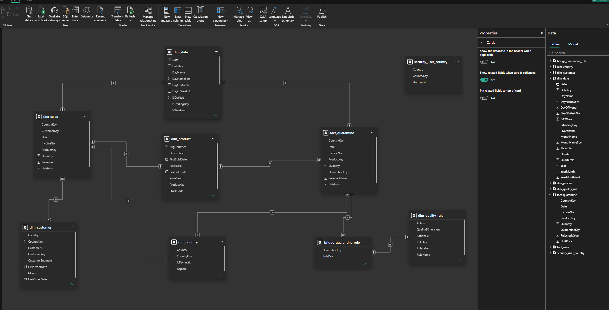

# Retail Data Pipeline & Product Recommendations

[](https://github.com/Kenchch/retail-ai-pipeline/actions/workflows/ci.yml)

A nightly pipeline that ingests retail invoice lines, enforces data quality,
publishes a sales star schema and a "frequently bought together" recommendation
table — plus the business-side work that decides whether any of it gets used: a
requirements brief, a user guide, an AI-literacy workshop and adoption
measurement wired into the pipeline itself.

```bash
pip install -r requirements.txt
python scripts/get_data.py           # ~45 MB of transactions + usage telemetry
python -m retail_pipeline.pipeline   # ~12 s end to end
pytest -q                            # 22 tests
```

## Results from a full run

Source: UCI **Online Retail** — a UK online giftware retailer, Dec 2010 – Dec 2011.

| | |
|---|---|
| Rows read | 541,909 line items across 25,900 invoices |
| Quarantined by data-quality rules | **19,343 (3.57%)** |
| Loaded | 522,566 line items · 3,803 products · 4,334 customers · 374 days (305 traded) |
| Recommendations | 17,083 rows covering the full catalogue |
| Adoption | 62 licensed users, 5 teams, 12 weeks |
| Runtime | 12.4 s — `runtime_seconds` in `reports/run_metrics.json` |

The strongest associations are ones a merchandiser would expect — the cheapest
sanity check there is:

```
LANDMARK FRAME COVENT GARDEN  ->  LANDMARK FRAME OXFORD STREET   lift 196.4   30 baskets
CHILDS GARDEN SPADE BLUE      ->  CHILDS GARDEN SPADE PINK       lift  95.1   40 baskets
```

Outputs: [`reports/data_quality_report.md`](reports/data_quality_report.md) ·
[`reports/adoption_report.md`](reports/adoption_report.md) · `reports/run_metrics.json`

## Power BI semantic layer

The warehouse this pipeline publishes is consumed by a Power BI semantic model
in [`bi/`](bi/) — star schema with surrogate keys and an unknown member, a
calendar built for time intelligence, a second fact table for data quality
joined on conformed dimensions, a many-to-many bridge for the quality rules, a
35-measure DAX library and dynamic row-level security over an entitlement table.



Reconciles to £10,247,353.28 over 19,773 orders, and 522,566 loaded + 19,343
rejected = 541,909 — the source row count.

Design and the decisions behind it: [`bi/MODEL.md`](bi/MODEL.md).
Build it yourself in ~45 minutes: [`bi/BUILD_POWERBI.md`](bi/BUILD_POWERBI.md).

## How it works

```
extract → data quality → star schema → load → recommend → adoption
```

Three modules, scheduled as nine Airflow tasks
([`dags/`](dags/retail_pipeline_dag.py)) so a failure names the stage that broke.
Every stage computes into per-run staging; a single `publish` task is the only
thing that writes to the warehouse, so it holds one run's output or the previous
run's and never a mixture of the two.

**Data quality (9 rules, 4 dimensions).** Cancellations, non-positive quantities
and prices, duplicates, price outliers and non-product stock codes are
**quarantined** — kept in a table with the rules they broke, not deleted, so a
rule that turns out to be too aggressive can be relaxed. Missing customer ids
(24.9% of rows — guest checkout) and blank descriptions are **flagged but kept**:
rejecting them would discard a quarter of the basket evidence to satisfy a rule
only customer analytics cares about. Above a configured rejection rate the run
**fails before loading**, so a broken extract leaves last night's data intact.

**Star schema.** `fact_sales` carries measures and keys only. `dim_date` is a
continuous calendar — this retailer is shut on Saturdays, and a dimension built
from observed dates would omit 53 of them and hand BI six-day weeks.

**Recommendations, two signals.** Co-purchase rules from transactions
(structured) ranked by **lift**, not raw co-occurrence — ranking by count makes
the best sellers the recommendation for everything. TF-IDF over product
description text (unstructured) covers the long tail that never reaches the
support threshold. Every row carries a `method` column so the two are never
conflated.

The population for support and confidence is **every** basket, including ones
holding a single item. A basket where A was bought alone is evidence against
"A → B", so dropping it inflates the rule. Three baskets, worked by hand:

```
{A}   {A, B}   {A, B, C}          all baskets = 3;  A in 3, B in 2, C in 1

support(A,B)    = 2/3 = 0.67
confidence(A→B) = 2/3 = 0.67      not 2/2 — the {A} basket stays in
lift(A,B)       = 0.67 / (2/3) = 1.0
```

`max_basket_size` filters pair *generation* only, for the same reason: a
1,107-item wholesale order would contribute 612k pairs of things that shared a
pallet, but the products in it were still sold. Both figures are therefore
conservative rather than inflated. `test_single_item_baskets_count_in_the_denominator`
pins the arithmetic above.

**Adoption.** Reach, activation, action rate and CSAT, weekly and by team.
Activation is the one that matters — a view changes nothing. A metric with no
data reports "–", never 0: nobody answering the survey is not everybody being
unhappy.

## The business-side half

| | |
|---|---|
| [Brief](docs/01_engineering_brief.md) | The problem, explicit non-goals, 7 requirements with acceptance criteria |
| [User guide](docs/02_user_guide.md) | How to read lift · three things the tool gets wrong · FAQ |
| [Adoption & comms](docs/03_adoption_and_comms.md) | Metric definitions, workshop runsheet, monthly update, roadmap |
| [Workshop deck](workshop/ai_literacy_workshop.pdf) | 6 slides, 60 minutes ([`.pptx`](workshop/ai_literacy_workshop.pptx)) |

Each one leads with what the tool **cannot** do — the brief lists non-goals, the
guide has "three things it will get wrong", the workshop opens on a real bad
recommendation. That is not modesty; it is the only way the rest gets believed.

> **On the usage data.** The event log is generated by `scripts/get_data.py`,
> because this has not been deployed to real users. The schema is the production
> schema and the metrics are computed from it for real; the production sources
> (Power BI usage metrics, merchandising audit log, feedback button) are
> documented in that script. Swapping in a real extract is one line in
> `config.yaml`. An adoption number of unclear provenance is worse than none.

## Tests

22 tests, concentrated on the failures that are *silent*: a quality rule that
stops firing, a team that drops out of the adoption report, a week with no
activity that closes the gap and shifts every later week's label, a metric with
no data reported as a zero. Nothing crashes when those regress — bad rows just
start flowing into the warehouse, which is why the tests exist.

## Stack

Python · pandas · scikit-learn · Parquet · SQLite (a stand-in for Azure SQL —
swapping it is a connection string) · Airflow · Git. All thresholds and the team
roster live in `config.yaml`; there are no magic numbers in the code.

---

Data: UCI Machine Learning Repository — *Online Retail* (Chen, D., 2015).
