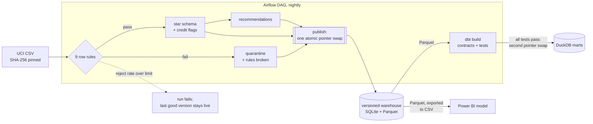

# Retail Data Pipeline & Product Recommendations

[](https://github.com/Kenchch/retail-ai-pipeline/actions/workflows/ci.yml)

A year of a UK online retailer's invoices, turned into sales reporting whose
totals trace back to the source file, and "bought together" recommendations
tested against a simple baseline. A portfolio project: it has not been
deployed, and all usage telemetry is simulated.

**Problem.** The UCI Online Retail export (541,909 invoice lines, December 2010
to December 2011) mixes sales with cancellations, negative quantities,
duplicate lines and postage codes. A revenue total taken straight off the file
depends on which of those lines it happens to include, and the same noise
feeds the recommender.

**Approach.** Airflow runs a Python pipeline that checks every row against nine
rules. Failing rows go to a quarantine table with the rules they broke instead
of being dropped. Clean rows become a star schema, written to a per-run version
and published by replacing one pointer, so a failed run never overwrites a good
one. dbt then builds contracted DuckDB marts from the published version, and
the Power BI model is built from CSVs exported from its Parquet files.

**Result.** 19,343 lines (3.6%) quarantined, each with a stated reason; loaded
plus quarantined equals the source row count. Recommendations reach a 56.3%
hit-rate@5 against 52.8% for a most-popular baseline (+3.5 points) on 161,844
held-out basket queries.

**Trade-offs.** Airflow, its Postgres metadata database and Docker Compose are
heavier than one 45 MB extract needs. They are here to show orchestration; for
a one-off analysis I would run the pipeline and dbt directly. Publication
relies on atomic renames on one machine, so running it distributed would mean
object storage and a shared warehouse ([why](docs/DESIGN.md#how-it-works)).


```mermaid
flowchart LR
    subgraph dag ["Airflow DAG, nightly"]
        gate{"9 row rules"}
        star["star schema<br/>+ credit flags"]
        quar["quarantine<br/>+ rules broken"]
        rec["recommendations"]
        pub[["publish:<br/>one atomic pointer swap"]]
        dbt["dbt build<br/>contracts + tests"]
        gate -->|pass| star
        gate -->|fail| quar
        star --> rec
        star --> pub
        quar --> pub
        rec --> pub
    end
    src["UCI CSV<br/>SHA-256 pinned"] --> gate
    gate -.->|reject rate over limit| stop["run fails;<br/>last good version stays live"]
    pub --> wh[("versioned warehouse<br/>SQLite + Parquet")]
    wh -->|Parquet| dbt
    dbt -->|"all tests pass:<br/>second pointer swap"| mart[("DuckDB marts")]
    wh -->|"Parquet, exported<br/>to CSV"| pbi["Power BI model"]
```

## Results and evidence

| Measure | Committed full-data result |
|---|---:|
| Input invoice lines | 541,909 |
| Loaded / quarantined | 522,566 / 19,343 (3.6%, each with the rules it broke) |
| Gross accepted positive sales | £10,247,353.28 over 19,773 invoices |
| Exact matched cancellations / net of those matches | £385,958.88 / £9,861,394.40, the same as the R analysis |
| Recommendation rows | 17,083, covering all 3,803 products |

Evidence: [run metrics](reports/run_metrics.json), [quality report](reports/data_quality_report.md),
[Power BI model](bi/MODEL.md) and [report pages](bi/README.md).

The [R companion analysis](https://github.com/Kenchch/online-retail-analysis-r)
now reports the same figure. It used to differ by £22,265.46, because it kept
the exact duplicate lines this pipeline quarantines; it now applies the same
duplicate rule, keyed on the same tuple, so both projects answer the question
the same way.
The Python fact flags 2,725 accepted lines matched to source credit notes
(29.3% of all 9,288 credit-note lines). Gross revenue remains unchanged;
**net of these exact matches is £9,861,394.40**. This uses full-extract hindsight
and attributes the adjustment to the original sale date, not the credit date.
Unmatched and partial credits are excluded. [Recomputed evidence](reports/cancellations.json)
is checked against the published fact by `python scripts/check_cancellations.py`.
The detailed revenue bridge is in [design notes](docs/DESIGN.md#reconciliation-with-online-retail-analysis-r).

## Temporal recommendation evaluation

Training uses accepted lines before 2011-10-01; evaluation uses later baskets.
Each product in a basket with at least two distinct products is a query, and a
hit retrieves another product in that basket. All three models use training data only.

| Model | Hit-rate@5 | Against most popular | Query coverage |
|---|---:|---:|---:|
| Hybrid | 56.3% | +3.5 pts | 95.2% |
| Most popular | 52.8% | baseline | 100.0% |
| Content TF-IDF | 51.7% | −1.1 pts | 95.2% |

The 161,844 queries are basket-completion queries, not independent customers.
This offline comparison does not measure sales uplift. The
[evaluation artifact](reports/evaluation.json) records counts, cutoff, source hash
and library versions. Reproduce with `python -m retail_pipeline.evaluate` after
fetching the data. The [revenue reconciliation](reports/reconciliation.json) can
be regenerated with `python scripts/check_revenue_bridge.py`.

## Run it

For a locally validated Airflow 3 + Postgres stack, see
[Docker Compose setup and successful-run screenshot](docs/LOCAL_AIRFLOW.md).

```bash
python -m pip install -r requirements.lock && python -m pip install -e . --no-deps
python scripts/get_data.py
python -m retail_pipeline.pipeline
pytest -q

# dbt consumer; install on every Airflow worker too
python -m pip install -r requirements-dbt.txt
python scripts/run_dbt.py
python scripts/check_cancellations.py
```

Airflow additionally requires `requirements-airflow.txt` and its versioned release
constraints. See [runtime and orchestration details](docs/DESIGN.md#how-it-works).

## Limits

What the project is now.

- Staging, the SQLite warehouse and the DuckDB marts are files on one host, and
  publication relies on renames on that host.
- Warehouse and downstream dbt promotion are separate transaction boundaries.
- Every run rebuilds the whole extract; nothing is loaded incrementally.
- The quality gate checks the reject rate, not the volume. The DAG emails on a
  failed task, but a run that never starts sends nothing.
- A missing source column fails the extract; a new or redefined one passes.
- Gross and exact-match-net revenue are separate; neither estimates unmatched refunds.
- Offline associations do not establish recommendation impact or causal uplift.
- Adoption metrics use generated telemetry, not real users.
- Power BI setup and the workshop describe a portfolio scenario.

## What this would need in production

What is missing, against the limits above. Not built here.

- **Freshness and volume alerts.** An Airflow deadline alert on the DAG, and a
  row-count check against the trailing seven-day median, so a half-empty
  extract fails instead of loading cleanly.
- **Incremental loads and backfill.** Loads partitioned by invoice date, and a
  backfill command keyed on it.
- **A source contract.** A versioned contract agreed with the source's owner,
  and a migration path for when it changes.
- **Shared storage.** Object storage for staging and a served warehouse, so the
  pipeline and its readers can run on different hosts. That is a rewrite of
  `load()`, not a new connection string ([design notes](docs/DESIGN.md#stack)).
- **Real usage data.** One of the production sources named in
  `scripts/get_data.py` (Power BI usage metrics, the merchandising audit log,
  the feedback button) wired in; until then the adoption report measures
  nothing real.
- **Less orchestration.** Cron running the pipeline and then dbt, until there
  are several jobs that depend on each other. At this volume Airflow and its
  database cost more to run than they save.

## Data and licence

Code is MIT. UCI Online Retail (Chen, 2015) is CC BY 4.0.
The downloader uses Databricks' Spark: The Definitive Guide CSV mirror and verifies
a pinned SHA-256. Raw data is downloaded locally and excluded from Git.
See [NOTICE](NOTICE) for attribution and transformations.

[Design notes](docs/DESIGN.md) · [User guide](docs/02_user_guide.md) ·
[Adoption and communication](docs/03_adoption_and_comms.md)

Documentation examples are computed in [doc_figures.json](reports/doc_figures.json).
After downloading the source, run `python scripts/verify_doc_figures.py`, then
`python scripts/build_workshop.py` (requires python-pptx) to refresh the editable
workshop. Its PDF is a rendered preview; the PPTX retains editable text and charts.

## How this was built

I used Claude Code and OpenAI Codex as drafting tools. The split of work:

**Mine**

- Problem framing, the choice of Airflow, dbt and DuckDB, and the decision to
  quarantine bad rows rather than drop them
- The row-level quality rules, and what counts as a cancellation
- The atomic publication scheme and the failure tests behind it
- Reconciling totals against the source file and against the R analysis
- Reviewing every generated change before commit. Drafts that were wrong were
  rejected or rewritten, for example:
  - a credit matcher that honoured duplicate credit lines the quality rule
    quarantines; `check_cancellations.py` caught it
    ([#17](https://github.com/Kenchch/retail-ai-pipeline/pull/17))
  - a publish step that renamed each Parquet file separately; fault injection
    showed it could leave tonight's facts beside last night's dimensions, so
    publication became one pointer swap

**AI-drafted, then reviewed and edited by me**

- Boilerplate: DAG scaffolding, pytest fixtures, dbt model stubs
- First drafts of docstrings and of this README

Commits made before 6 September 2026 carried `Co-Authored-By` trailers naming
these tools. They were removed when I rewrote that history; commits since then
carry them, and each pull request states its own AI involvement.
