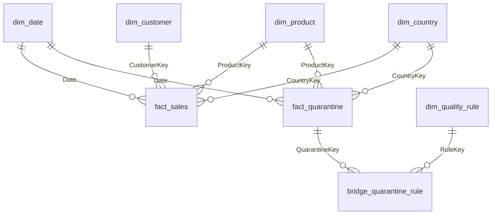

# Semantic model — design notes

The pipeline publishes a warehouse star schema. This layer turns it into a
Power BI semantic model. The two are not the same thing, and the gap between
them is where most of the decisions below live.

Built by [`build_star_schema.py`](build_star_schema.py) from
`data/processed/*.parquet`; output in [`model/`](model/) as CSV.
Measures in [`measures.dax`](measures.dax). Build instructions in
[`BUILD_POWERBI.md`](BUILD_POWERBI.md).

---

## The model

`security_user_country` is deliberately **disconnected** — no relationship to
anything. `dim_customer` is deliberately **not** related to `dim_country`
either; see decision 8 below.

| Table | Grain | Rows |
|---|---|---:|
| `fact_sales` | one invoice line | 522,566 |
| `fact_quarantine` | one rejected source row | 19,343 |
| `bridge_quarantine_rule` | one rejected row × one rule it broke | 30,739 |
| `dim_date` | one calendar day, 2010-01-01 → 2011-12-31 | 730 |
| `dim_product` | one stock code, + 1 non-product member | 3,804 |
| `dim_customer` | one customer id, + 1 guest member | 4,335 |
| `dim_country` | one country, + 1 unknown member | 39 |
| `dim_quality_rule` | one quality rule | 9 |
| `security_user_country` | one user × one country they may see | 10 |

Reconciliation: **£10,247,353.28** over **19,773 orders**;
522,566 + 19,343 = **541,909**, the row count of the source extract.

---

## Decisions

### 1. The calendar spans whole years, not the observed range

The warehouse date dimension covers 2010-12-01 to 2011-12-09 — the dates that
exist in the data. Time intelligence over that is broken in a way that does not
announce itself: `SAMEPERIODLASTYEAR` for March 2011 looks for March 2010,
finds no rows in the date table, and returns blank. A YoY column of blanks
reads as "no growth data yet" rather than "your date table is too short".

The semantic calendar runs 2010-01-01 to 2011-12-31, contiguous, with
`IsTradingDay` flagging the 305 days the retailer actually traded. Power BI
refuses to mark a non-contiguous table as a date table, and the build script
asserts contiguity before writing.

The honest caveat, which belongs on the report page and not buried here: a
like-for-like year-on-year comparison only exists for December. `Revenue YoY %`
is written to return blank rather than +100% against an empty prior period.

### 2. Guest checkout gets an explicit dimension member

131,418 sales lines (25.1%, £1.51M, 14.7% of revenue) have no customer id —
guest checkout. The pipeline flags this rather than rejecting it, correctly:
dropping a quarter of the basket evidence to satisfy a rule only customer
analytics cares about would be the wrong trade.

But a null foreign key in a semantic model is not neutral. Power BI creates a
blank row in the dimension, and a blank row does not appear in a slicer. So
every customer-sliced visual quietly loses £1.51M and nothing on the page says
so. `CustomerKey = -1` — `(guest)`, segment `5. Guest checkout`,
`IsGuest = TRUE` — makes the gap addressable: filterable in, filterable out,
and measurable via `Guest Revenue %`.

`Customers` excludes the guest member on purpose. One surrogate key standing in
for 131,418 anonymous sessions is not a customer, and counting it as one is a
small lie that gets repeated in every distinct-count on the report.

### 3. Aggregates are removed from the dimensions

The warehouse `dim_product` carries `revenue`, `units_sold`, `n_invoices`;
`dim_customer` carries `total_revenue`. These are facts in dimension tables.
The failure mode is quiet: a user filters the page to March, drags
`total_revenue` onto a card, and gets the all-time number, because a dimension
column does not respond to a filter on the fact.

They are dropped. Measures compute the same values from `fact_sales` and
respond to filters. `FirstSoldDate` / `LastSoldDate` survive — they are dates,
not additive quantities, and behave correctly as attributes.

`CustomerSegment` also survives, and is the one judgement call here: it is
derived from revenue, so it is a fact-shaped thing living in a dimension. It
stays because "who is a top-decile customer" is a question about the customer,
not about a period, and because it is recalculated every load. It is a **Type-1
snapshot attribute**, not a slowly changing dimension — history of how someone
was banded is not a question this model is asked, and building a Type-2 for it
would triple the row count to answer nothing.

### 4. Quality is a second fact table, not a report

`fact_quarantine` shares `dim_date`, `dim_product` and `dim_country` with
`fact_sales`. The point of conforming them is that one set of slicers drives
both: pick Germany and March and the page shows what sold *and* what was
rejected, side by side, without a second report and a second set of filters
that drift out of sync.

`RejectedValue` is deliberately not called Revenue. It sums to **−£499,605** —
negative, because the rejected pile is dominated by cancellations and returns
carrying negative quantities. That sign is the whole argument for quarantining
them, and a quality page showing a tidy positive number would be hiding it.

### 5. Rule is many-to-many, so it gets a bridge

A rejected row breaks 1.59 rules on average. The pipeline stores this as a
comma-separated string (`cancelled_invoice,non_positive_quantity`). That is
fine in a warehouse and useless in a semantic model: you cannot slice by it,
and a text filter for "price_outlier" would silently miss nothing and match
nothing consistently.

`bridge_quarantine_rule` makes the grain explicit — one row per rejected row
per rule broken. Two consequences the report must respect:

- **`Rejected Rows` sliced by rule does not sum to 19,343.** It sums to more.
  This is correct, and the visual says so, because a table of nine numbers that
  do not add to the total printed above them will otherwise be read as a bug.
- **`Rule Violations` does sum**, because one row per violation *is* its grain.
  When you need something additive across rules, that is the measure.

`Rejected Rows` is written as `DISTINCTCOUNT(bridge[QuarantineKey])` rather
than `COUNTROWS(fact_quarantine)`. Both give 19,343 unfiltered, but the first
responds to a rule filter without a bidirectional relationship into the fact.
`Rejected Value` needs the fact table itself, so it uses `TREATAS` to push the
bridge's selection across — same result, no bidirectional filtering turned on.

Bidirectional filtering would work and is one checkbox. It is avoided because
it is not local: once on, the bridge filters the fact in every context, and the
next ambiguity it introduces will surface as a wrong number in an unrelated
visual months later. `TREATAS` costs one line and stays where it is written.

### 6. Non-product stock codes collapse to one member

3,069 quarantined rows carry 155 distinct stock codes that never became
products — `POST`, `BANK CHARGES`, `M`, `DOT`. The quality page has to slice by
them, so they cannot be dropped, but they are not catalogue items and putting
155 of them in `dim_product` makes every product slicer worse for everyone.

They map to `ProductKey = -1`, `(non-product)`, `IsSellable = FALSE`. The
quality page slices by `dim_quality_rule[RuleName] = non_product_stock_code`
when it needs the detail, which is a better question anyway.

### 7. InvoiceNo is a degenerate dimension

It lives on the fact with no dimension table behind it, because it has no
attributes of its own — everything you would put on a `dim_invoice` (date,
customer, country) is already a conformed dimension. `Orders` is therefore a
`DISTINCTCOUNT` on a fact column rather than a row count on a dimension.

### 8. `dim_customer` is not related to `dim_country`

Both `fact_sales` and `dim_customer` carry a country. Relating `dim_country` to
both creates two filter paths from country to the fact — direct, and via the
customer — which is ambiguous. Power BI resolves it by deactivating one
relationship, silently, and from then on half the country filters go somewhere
other than where the model diagram suggests.

`fact_sales[CountryKey]` is the relationship; `dim_customer[Country]` stays as
a descriptive attribute with no relationship behind it. The two answer
different questions — where an order shipped versus where a customer is based —
and conflating them is exactly what the ambiguity would have done.

The `CountryKey` column on `dim_customer` is left in the CSV for downstream
tools that want the join. In this model it is not used.

### 9. Region splits domestic from export, not by continent

`dim_country[Region]` is `United Kingdom` / `Europe` / `Rest of world` /
`Unspecified`. A UK retailer's first question about geography is domestic
versus export; a continent grouping puts the home market — 91% of rows — in the
same bucket as Germany and answers nothing. The `IsDomestic` flag exists for
measures that need the split without the label.

### 10. Row-level security is dynamic and fails closed

One role, `Territory`, driven by `security_user_country`. The alternative — a
static role per market — needs a new role and a republish every time someone
changes territory, and by the fifth market nobody can say who sees what.

Four things the design gets right that are usually missed:

- **Three tables are filtered, not one.** Filtering `dim_country` secures the
  numbers and leaks the names: dimensions are not filtered by the fact, so a UK
  analyst would still see all 4,334 customers in a slicer. `dim_customer` and
  the mapping table carry their own filter in the same role. The leak that
  matters is a name appearing where a number correctly does not — which is why
  the test checklist checks the customer slicer, not just the revenue card.
- **The mapping table filters itself.** Without a filter on
  `security_user_country`, any user with access can drop it into a visual and
  read the entire entitlements list, including which accounts hold the
  wildcard.
- **Head office uses the same mechanism.** The `*` wildcard row gives group BI
  everything through `security_user_country`, not through a second unfiltered
  role. One place to look when asked who can see what.
- **An unmapped account sees nothing, and is told so.** `nobody@example.com`
  returns no rows. The visuals carry `No Data Message` so the reader gets a
  sentence rather than a blank canvas they will report as a broken dashboard.

`security_user_country` in `model/` is **sample data with placeholder
addresses**. In production it is a view over the entitlements or HR system,
refreshed with the model.

---

## What this model does not do

- **No slowly changing dimensions.** Product descriptions and customer
  countries overwrite on load (Type 1). The source is a flat extract with no
  effective dates, so a Type-2 would be inventing history it does not have.
- **No aggregation tables.** 522k rows import in seconds and compress to a few
  MB; a user-defined aggregation here would be optimising a problem that does
  not exist.
- **No incremental refresh.** The source is a static 2010–2011 extract. The
  partitioning policy would be untestable and therefore decorative.
- **The recommendations and adoption tables are out of scope.** Adoption events
  are stamped 2026 and would need their own date dimension, breaking the single
  conformed calendar for no analytical gain. They belong in a second model.
