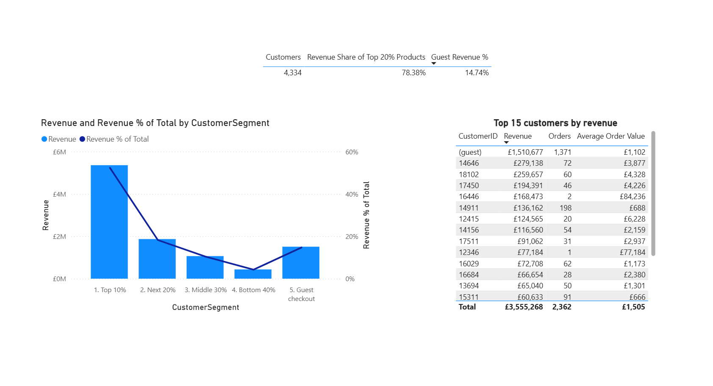
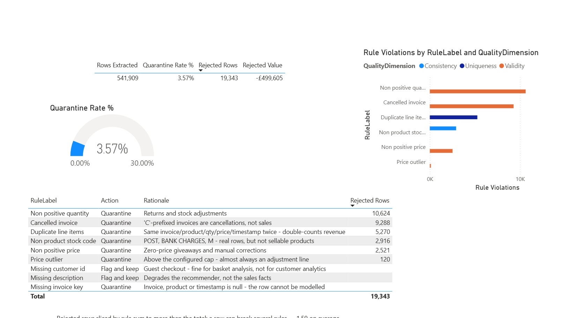

# Power BI semantic layer

The pipeline in this repo publishes a warehouse star schema. This folder turns
it into a **Power BI semantic model**: surrogate keys, an unknown member, a
calendar that supports time intelligence, a second fact table for data quality,
a many-to-many bridge, a 35-measure DAX library and dynamic row-level security.

Two fact tables on conformed dimensions, so one set of slicers answers both
*what sold* and *what we rejected and why*.


The model behind it — two fact tables sharing every dimension:


```
                dim_date ────┬──── fact_sales ────┬──── dim_product
                             │     522,566 lines  │
             dim_customer ───┤                    ├──── dim_country
                             │                    │
                             └── fact_quarantine ─┘
                                  19,343 rows
                                       │
                        bridge_quarantine_rule (30,739)
                                       │
                              dim_quality_rule (9)
```

Reconciles to **£10,247,353.28** over **19,773 orders**.
522,566 loaded + 19,343 rejected = **541,909**, the row count of the source
extract — the one check that proves nothing was dropped silently between the
source file and the report.

## What is in here

| | |
|---|---|
| [`MODEL.md`](MODEL.md) | The design and the decisions behind it — read this one |
| [`measures.dax`](measures.dax) | 35 measures and the three RLS role expressions |
| [`BUILD_POWERBI.md`](BUILD_POWERBI.md) | Click-by-click build, ~45 min, with the numbers to validate against |
| [`build_star_schema.py`](build_star_schema.py) | Warehouse star → semantic model CSVs |
| [`screenshots/`](screenshots/) | Model view and the three report pages |

The nine model CSVs are **build output and are not committed** — `fact_sales.csv`
alone is 21 MB and is rewritten wholesale on every run, which is the worst
possible shape for a git object. Reproduce them from a fresh clone in three
commands:

```bash
python scripts/get_data.py           # ~45 MB source extract into data/raw
python -m retail_pipeline.pipeline   # produces data/processed/*.parquet
python -m bi.build_star_schema       # produces bi/model/*.csv
```

The build script validates before it writes: referential integrity on every
foreign key, uniqueness on every dimension key, and contiguity on the calendar.
It exits non-zero rather than publishing a model with orphans in it.

## The report

Three pages, each answering a different question rather than showing a different
chart type.

| | |
|---|---|
|  | **Sales overview** — revenue, orders, AOV, customers; revenue by month against last year, by country, by product. |
|  | **Customers** — value segments including guest checkout, top customers, and the concentration curve. |
|  | **Data quality** — rows extracted vs loaded vs quarantined, rejection rate against the configured abort threshold, and rejections by rule. |

## The four decisions worth arguing about

**Guest checkout gets a dimension member, not a null.** 25.1% of sales lines
have no customer id. A null foreign key becomes a blank dimension row, and a
blank row does not appear in a slicer — so every customer-sliced visual quietly
loses £1.51M and nothing on the page says so. `CustomerKey = -1` makes the gap
filterable and measurable instead of invisible.

**The calendar covers whole years, not the observed range.** The data starts
2010-12-01. `SAMEPERIODLASTYEAR` over a calendar that starts there returns blank
for eleven months of 2011, which a reader takes as "no growth yet" rather than
"the date table is too short". The calendar runs 2010-01-01 to 2011-12-31 and
flags the 305 days actually traded, so a per-day rate is not diluted by 53
non-trading days.

**Aggregates come out of the dimensions.** `dim_product.revenue` and
`dim_customer.total_revenue` are facts sitting in dimension tables: filter the
page to March, drag one onto a card, and you get the all-time number. Measures
replace them.

**Rule is many-to-many, so it gets a bridge.** A rejected row breaks 1.59 rules
on average; stored as a comma-separated string it cannot be sliced. The bridge
makes the grain explicit — and the consequence is stated on the report page
itself, that rejected rows sliced by rule correctly do *not* sum to the total.
Nine numbers that do not add up to the figure above them get read as a bug, and
the reader is right to ask.

## Row-level security

One dynamic role driven by an entitlement table, not a static role per market.

Three tables carry a filter, not one: filtering `dim_country` alone secures the
numbers and leaks the names, because dimensions are not filtered by the fact and
a regional analyst would still see all 4,334 customers in a slicer. Every role
was verified against the customer slicer, not only the revenue card.

An unmapped account resolves to nothing and is told why rather than shown a
blank canvas. The `*` wildcard puts head office through the same mechanism
rather than a second unfiltered role, so there is one place to look when someone
asks who can see what.

> `model/security_user_country.csv` is **sample data with placeholder
> addresses**. In production it is a view over the entitlements system,
> refreshed with the model.

## What this model deliberately does not do

No SCD Type 2, no aggregation tables, no incremental refresh, no composite
model. Each is a real technique with a real cost, and the reasoning for leaving
each one out is in [`MODEL.md`](MODEL.md) — a portfolio model that adopts every
pattern available demonstrates less judgement than one that says why it stopped.
