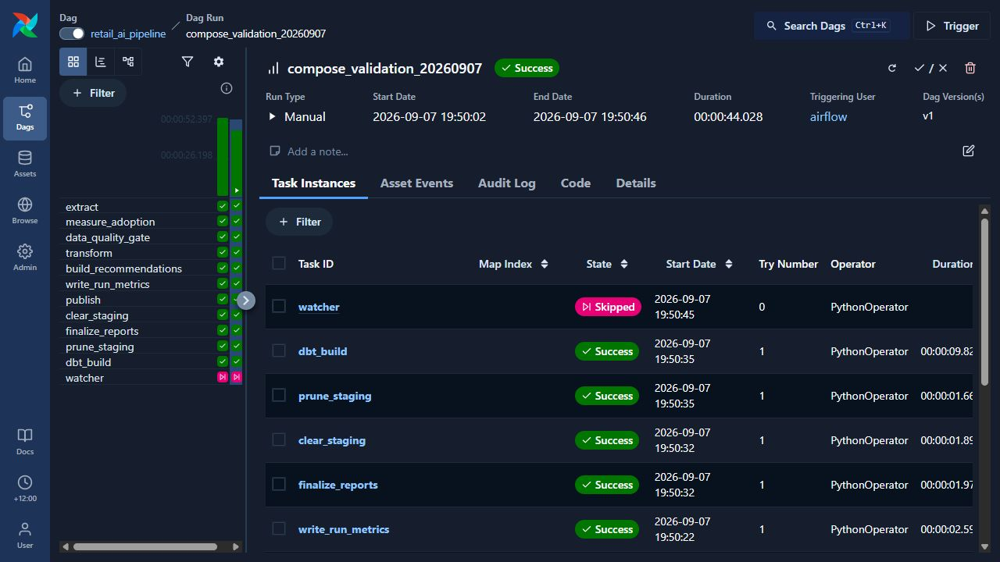

# Local Airflow with Docker Compose

Requires Docker Desktop with Linux containers and Compose v2 or newer. Allow
at least 4 GB of container memory and several GB of free disk for the image,
source CSV, metadata and published runs.

From the repository root:

```bash
docker compose up --build airflow-init
docker compose up -d
```

Initialization migrates the PostgreSQL metadata database and downloads the
SHA-256-checked retail extract plus reproducible simulated usage events. Open
http://localhost:8080, enable `retail_ai_pipeline` and use **Trigger**. Enabling
also permits the DAG's daily schedule, so a scheduled run may precede the manual
run. `max_active_runs=1` serializes publication.

The equivalent CLI trigger after the DAG appears is:

```bash
docker compose exec airflow-scheduler airflow dags unpause retail_ai_pipeline
docker compose exec airflow-scheduler airflow dags trigger retail_ai_pipeline
```

This is a localhost-only development environment. SimpleAuthManager grants
local visitors administrator access, and the database password/JWT secret are
public development defaults. Do not expose the port or use these settings for
shared hosting. Postgres has no published host port.

## Layout and maintenance

The API server, scheduler/LocalExecutor and DAG processor share one image and
named data/report/dbt/log volumes. Postgres stores Airflow metadata; the pipeline
still publishes its own SQLite warehouse and dbt builds with DuckDB. LocalExecutor
runs tasks in scheduler processes, so no Redis or Celery workers are needed.

DAG and pipeline source are read-only bind mounts. Other code/dependency changes
need `docker compose build` followed by the initialization and startup commands.
Initialization refreshes dbt project files without removing historical runs.

```bash
docker compose ps
docker compose logs --tail 100 airflow-scheduler airflow-dag-processor
docker compose exec airflow-scheduler airflow dags list-import-errors
docker compose exec airflow-scheduler cat /opt/retail/published/CURRENT.json
docker compose down
```

`down` stops this stack and preserves named volumes. Do not add `--volumes`
unless you intend to erase its downloaded data, metadata and published runs.
If 8080 is occupied, change only the host port in the Compose port mapping.
The image checks installed dependency consistency with `pip check`; transitive
Airflow/dbt dependencies are not fully locked by this development image.

## Verified run, 7 September 2026

Locally built and executed with Docker Desktop 29.6.2 / Compose 5.3.1,
Airflow 3.3.1 (Python 3.11), LocalExecutor and Postgres 16. The manual run
`compose_validation_20260907` finished successfully in 44.028 seconds after
initialization: 11 tasks succeeded, including the real dbt build, and the failure
watcher was skipped as intended. `published/CURRENT.json` points to that run.
The screenshot is captured from the actual UI (Pacific/Auckland display time).



This demonstrates the Compose infrastructure and full-data DAG execution. CI
also executes success and failure DAG fixtures independently using `dag.test()`.
